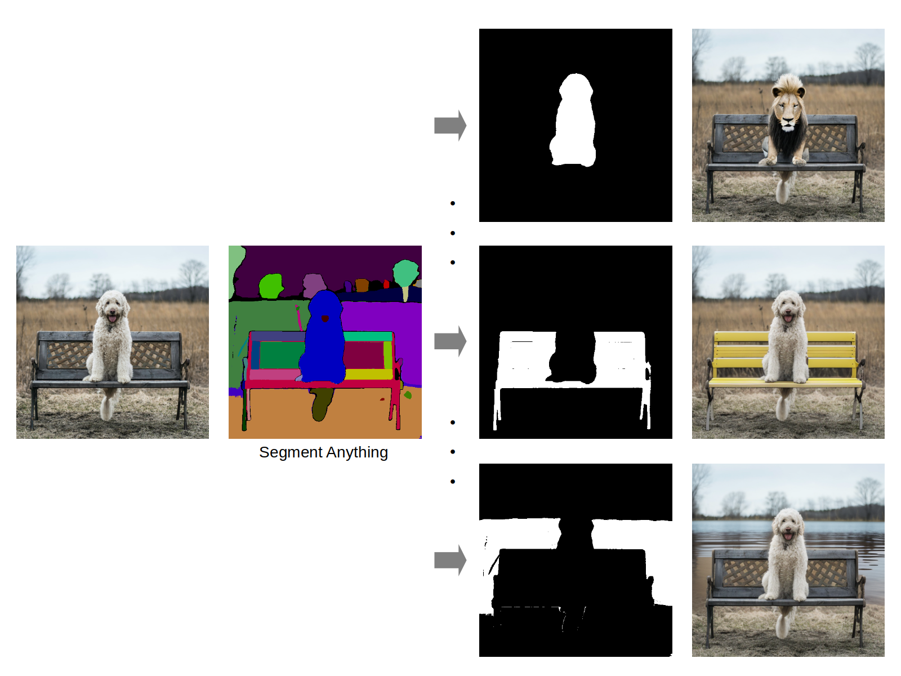
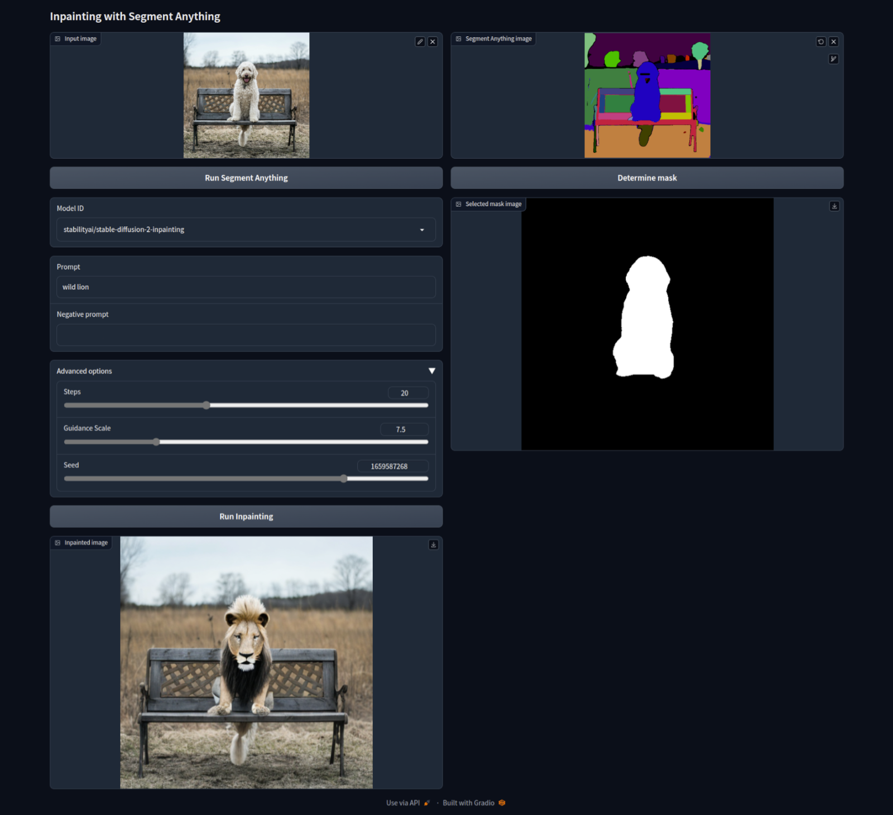

# Inpaint Anything (Inpainting with Segment Anything)
Inpaint Anything executes Stable Diffusion Inpainting on browser UI using selected any mask from the output of [Segment Anything](https://github.com/facebookresearch/segment-anything).  



## Installation
```bash
conda create -n inpaint python=3.10
conda activate inpaint
git clone https://github.com/Uminosachi/inpaint-anything.git
cd inpaint-anything
pip install -r requirements.txt
```

## Download model
* Download sam_vit_h_4b8939.pth from [model checkpoint](https://github.com/facebookresearch/segment-anything#model-checkpoints)
* Put the model in the same directory as iasam_app.py file

## Run
```bash
python iasam_app.py
```
* Open http://127.0.0.1:7860/ in your browser
* Recommended browser : Microsoft Edge or Mozilla Firefox (Because of can't get the mask with Google Chrome)

## Usage
* Drag and drop your image to the input image area
* Click the "Run Segment Anything" button
* Point by sketching inside the segment to inpaint
* Click the "Determine mask" button (the mask is showed in the selected mask image area)
* Select Model ID, Enter Prompt and Negative prompt
* Click the "Run Inpainting" button (**It take some time to download the model the first time**)

Inpainting is done by [diffusers](https://github.com/huggingface/diffusers).



## Auto save images
* Set environment variables before running
* Images be saved in the current directory
```bash
export IASAM_DEBUG=1
```

## License
The source code is licensed under the [Apache 2.0 license](LICENSE).
